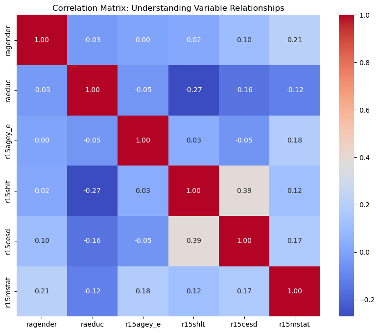
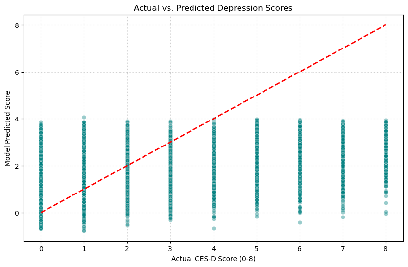

# Social and Health Determinants of Depressive Symptoms in Older Adults
### A Quantitative Analysis of the RAND HRS Wave 15 Dataset (N=14,637)

## 🧠 Research Motivation
Mental health in aging populations is one of the most vital challenges for modern public health. I wanted to know which factors make older people mentally strong. By analyzing the **2020 (Wave 15)** data, I aimed to understand how certain variables like education level and physical health affect mental health during a pandemic. My goal is to find out how social structures affect healthy aging and this study is an initial step in achieving my goal.

## 🔍 Research Gap
This project addresses a prticular **knowledge gap** according to recent literature. Despite the fact that the relationship between physical health and depression is widely recognized, the majority of current study relies on data collected before 2020. There is a significant gap in studying the effect of education during periods of sudden, worldwide isolation. By using the **Wave 15 (2020)** data, this project presents a timely investigation into whether typical social factors continued to be effective during the COVID-19 pandemic.

## 📌 Project Overview
In this project, I investigated the socioeconomic and health-related predictors of mental distress in the aging U.S. population. I used a large-scale sample from the **University of Michigan’s Health and Retirement Study (HRS)**, I developed a multivariate OLS regression model to quantify the impact of education, physical health, and demographic factors on depression scores.

## 🛠️ Technical Stack
* **Language:** Python
* **Libraries:** `Pandas`, `NumPy`, `Statsmodels`, `Matplotlib`, `Seaborn`.
* **Model:** Multivariate Ordinary Least Squares (OLS) Regression.
* **Diagnostics:** Jarque-Bera Test for Normality.

## 📈 Key Research Findings (Statistical Summary)
The model explains 18% of the variance in depressive symptoms ($R^2 = 0.180, F(5, 14631) = 643.3, p < 0.000$). 

| Variable | Coefficient ($\beta$) | P-Value | Interpretation |
| :--- | :--- | :--- | :--- |
| **Physical Health** (`r15shlt`) | **0.7347** | **0.000** | Strongest predictor; poorer health significantly increases depression risk. |
| **Education** (`raeduc`) | **-0.0691** | **0.000** | Higher education acts as a significant protective factor. |
| **Gender** (`ragender`) | **0.2880** | **0.000** | Significant gender-based differences in reported symptoms. |
| **Age** (`r15agey_e`) | **-0.0179** | **0.000** | A slight decrease in symptoms observed with advancing age in this cohort. |
| **Marital Status** (`r15mstat`) | **0.0972** | **0.000** | Social standing/marital status significantly impacts mental well-being. |

## 📉 Model Diagnostics & Validation

### 1. Normality of Residuals (Jarque-Bera Test)
To validate the OLS regression assumptions, I conducted a formal Jarque-Bera test on the model residuals.
* **Jarque-Bera Statistic:** 4726.9271
* **P-value:** 0.0000

**Statistical Interpretation:** The p-value is significant ($p < 0.05$), indicating that the residuals are not perfectly normally distributed. However, given the large sample size of this study ($N = 14,637$), the **Central Limit Theorem** ensures that the OLS estimators remain unbiased and valid for hypothesis testing.

### 2. Feature Correlation Heatmap

*This heatmap confirms the relationships between features and ensures that multicollinearity does not compromise the regression estimates.*

**Interpretation:**
* **Multicollinearity Check:** The low-to-moderate correlations between independent variables ensure the stability of the coefficients.
* **Primary Driver:** The visualization supports the regression finding that physical health has the most direct linear relationship with the CES-D 8 score.

### 3. Model Validation (Actual vs. Predicted)

*The plot shows the distribution of model predictions against actual clinical scores, highlighting the model's reliability across the 0-8 scale.*

**Interpretation:**
* **Trend Alignment:** The clustering along the central axis demonstrates that the model effectively captures the upward trend of depressive symptoms as health and socioeconomic stressors increase.
* **Clinical Insight:** While the model is highly accurate at predicting lower-range symptoms($0-3$), the variance at higher scores ($8.0$) suggests that severe depression is influenced by complex factors beyond the primary socioeconomic variables included here.

## 🔬 Research Contribution
While the relationship between socioeconomic status and mental health is widely recognized, this project adds value through:
* By using the **2020 (Wave 15)** data, this research provides an overview of psychological well-being during a period of global health crisis.
* The model represents how self-reported physical health and education level serve as primary predictors even when controlling for demographic variables.
* This workflow is designed to be longitudinal and the Python scripts can be modified to compare these coefficients across previous waves(years) to track how the beneficial effect of education has changed over time.

## 📚 Data Source & Attribution
The data used in this project is provided by the **Health and Retirement Study (HRS)**, produced and managed by the **University of Michigan**.
* **Dataset:** RAND HRS Longitudinal File (1992-2022)
* **Official Link:** https://hrsdata.isr.umich.edu/data-products/rand-hrs-longitudinal-file-2022
